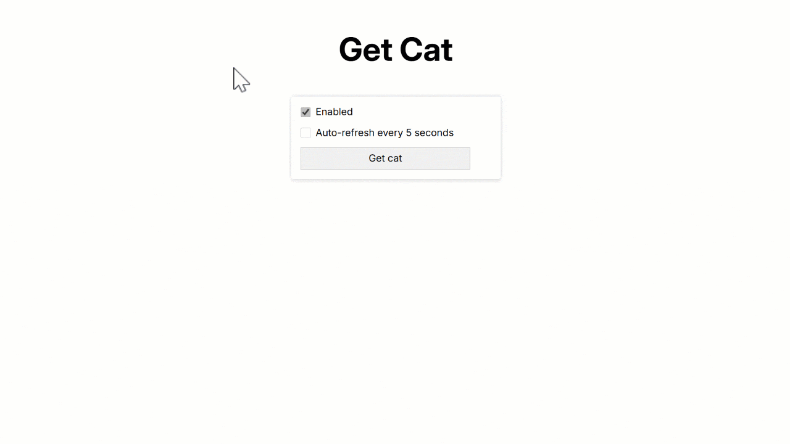

# ~{ Get Cat }~ Test Project

## Description

### An app that fetches cats from an API endpoint and renders them as a card

### Features

- Pixel-Perfect layout
- More than 3 components (CSS Modules)
- Fetching from a REST-API

### Dependencies

- `Vite`
- `React` • `CSS Modules`

## Installation & Execution

### Install via Vite

```bash
  git clone https://github.com/mirzaianov/test-get-cat.git
  cd test-get-cat
  pnpm install
```

### Run in the development mode

```bash
  pnpm run dev
```

Vite will start frontend server on [http://localhost:5173/](http://localhost:5173/)

### Or open the deployed site

[https://get-cat-mirzaianov.vercel.app/](https://get-cat-mirzaianov.vercel.app/)

## License

### MIT license

You can use the code, but I ask you do not copy this site without giving me credit
